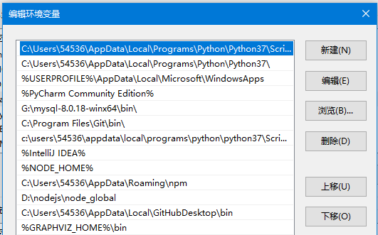
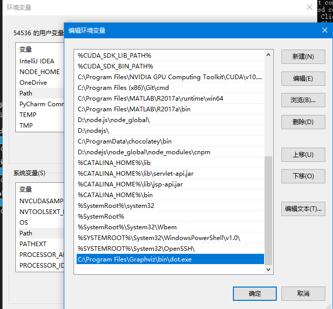

# Dask

## 1. dask安装

```bash
pip install dask[complete]
# 为了使用dask中的visualize()方法，需要下载graphviz
https://gitlab.com/graphviz/graphviz/-/package_files/9574245/download
# 安装完成后，需要添加环境变量
```

## 2. 添加环境变量（用户变量至GRAPHVIZ_HOME，至Path）




## 3. 添加环境变量（系统变量至Path）

