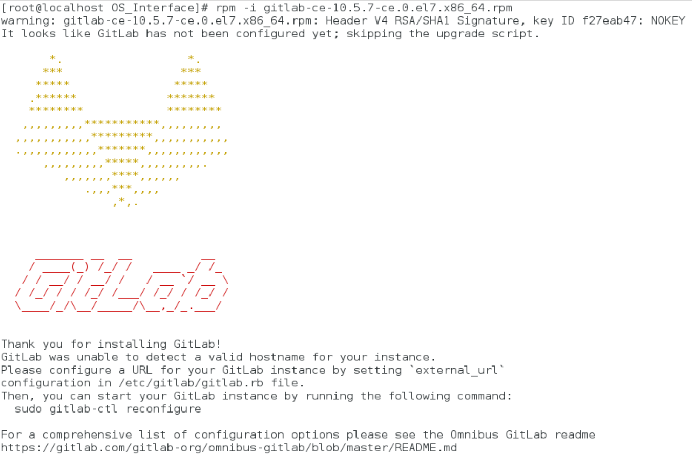

<Badge text="Tip" type="tip"/>
> 安装ssh、安装firewall、安装postfix

## 1. ssh
```bash
sudo yum install -y curl policycoreutils-python openssh-server
sudo systemctl enable sshd
sudo systemctl start sshd
sudo service sshd status
```
***

## 3. firewall

```bash
yum install firewalld sysemd -y
service firewalld start
sudo firewall-cmd --permanent --add-service=http
sudo systemctl reload firewalld
```
***

## 4. postfix
```bash
sudo yum install postfix
sudo systemctl enable postfix
sudo systemctl start postfix
# 在安装Postfix期间，可能会出现配置屏幕。选择“Internet Site”并按enter键。使用您的服务器的外部DNS以“mail name”并按enter。如果出现额外的屏幕，继续按enter键接受默认值。
```
***

## 5. 安装wget、vim
```bash
yum -y install wget
yum -y install vim
```
***

## 6. 添加gitlab镜像
```bash
wget https://mirrors.tuna.tsinghua.edu.cn/gitlab-ce/yum/el7/gitlab-ce-10.0.0-ce.0.el7.x86_64.rpm
## 不成功，但是可以下载
```
***

## 7. 安装gitlab
```bash
rpm -i gitlab-ce-10.0.0-ce.0.el7.x86_64.rpm
```

***

## 8. 配置gitlab

```bash
vim /etc/gitlab/gitlab.rb  //设置external-URL为lgit.gitlab.cc
gitlab-ctl reconfigure
gitlab-ctl restart
```
***

## 9. 其它
### 1. 502错误
```bash
# 防火墙未添加端口
firewall-cmd --state
firewall-cmd --zone=public --add-port=8090/tcp --permanent
# 端口占用
netstat -ntpl
# 权限
chmod -R 755 /var/log/gitlab
# 访问地址
127.0.0.1:80
```

### 2. 虚拟机部署gitlab
```bash
# 使用ping baidu.com查看虚拟机网络是否通畅，否则添加网卡
vim /etc/resolv.conf
# 添加一行
nameserver 8.8.8.8
# 查看虚拟机IP
ifconfig
# 设置本机（虚拟机）域名
vim /etc/hosts
# 添加127.0.0.1 git.gitlab.cc
# 执行
hostnamectl set-hostname git.gitlab.cc
vim /var/opt/gitlab/gitlab-rails/etc/gitlab.yml
# host: git.gitlab.cc
# port: 80
vim /etc/gitlab/gitlab.rb
external_url 'http://git.gitlab.cc'
```

### 3. gitlab的汉化
```bash
# 下载汉化补丁
git clone https://gitlab.com/xhang/gitlab.git  # 此为一开源汉化项目
# 确定当前Gitlab版本
cat /opt/gitlab/embedded/service/gitlab-rails/VERSION
cat /opt/gitlab/embedded/service/gitlab-rails/VERSION
# 比较原标签和汉化标签，导出patch用的diff文件
cd gitlab
git diff v10.5.7 v10.5.7-zh> ../10.5.7-zh.diff
cd gitlab
git diff v10.5.7 v10.5.7-zh> ../10.5.7-zh.diff
# 先停止gitlab
gitlab-ctl stop
gitlab-ctl stop
# 上传10.5.1-zh.diff文件到服务器
patch -d /opt/gitlab/embedded/service/gitlab-rails -p1 < ../10.5.1-zh.diff
patch -d /opt/gitlab/embedded/service/gitlab-rails -p1 < ../10.5.1-zh.diff
# 然后启动gitlab
gitlab-ctl start
gitlab-ctl start
```

