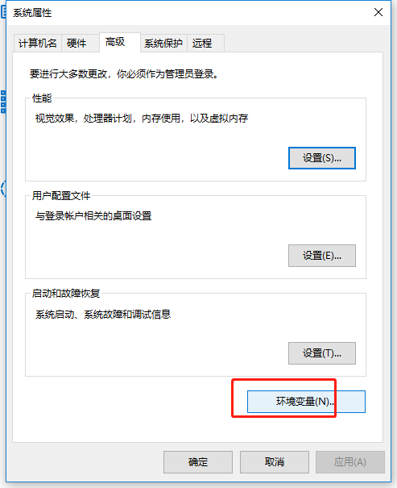
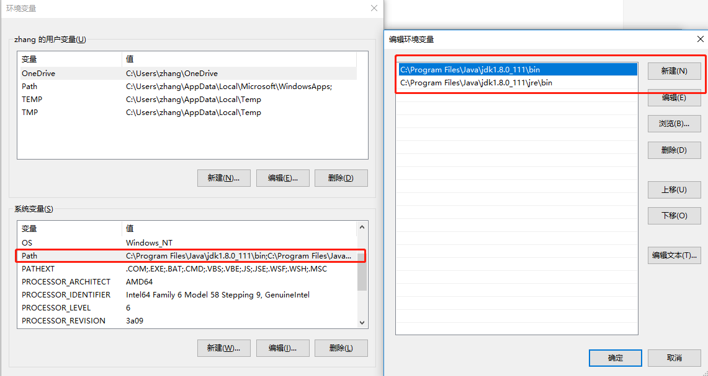
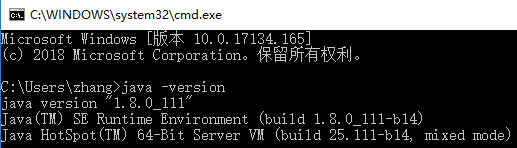

# Java安装

<Badge text='window系统安装java' type='error' /> 

## 1. 下载JDK
```bash
# 首先需要下载java开发工具包JDK，下载地址：http://www.oracle.com/technetwork/java/javase/downloads/index.html
# 进行安装，本机为64位，所以安装了64位版本
```
## 2. 配置环境变量

> 高级系统设置

> 环境变量

> 在"系统变量"中设置属性，JAVA_HOME，PATH(大小写无所谓)，若已存在则点击"编辑"，不存在则点击"新建"。
- 变量名：JAVA_HOME
- 变量值：C:\Program Files\Java\jdk1.8.0_111
- 变量名：Path
- 变量值：C:\Program Files\Java\jdk1.8.0_111\bin;C:\Program Files\Java\jdk1.8.0_111\jre\bin;



 
<badge text='注意：因为使用的为1.5版本以上的JDK，所以不用配置CLASSPATH环境变量，这里就略去' type='warn'/>
 
## 3.测试JDK是否安装成功
```bash
# "开始"->"运行"，键入"cmd"；
# 键入命令: **java -version**、**java**、**javac** 几个命令，出现以下信息，说明环境变量配置成功；
```

