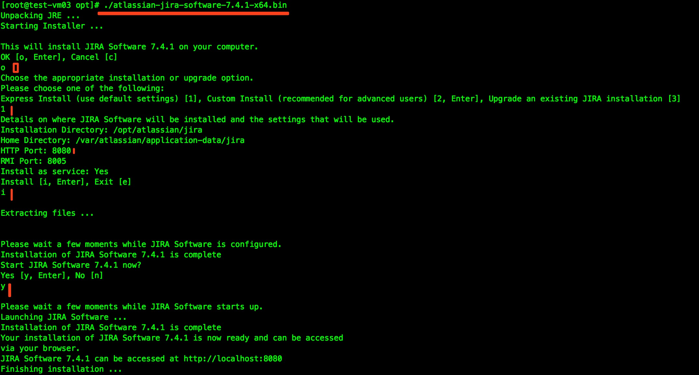

# JIRA安装

BGSM-FQZA-QLWI-UCYS

https://www.cnblogs.com/kevingrace/p/7608813.html

## 1. 数据库中添加Jira用户
``` bash
# 安装jdk8环境（在confluence有关文档中查看安装与配置过程）
# 创建jira数据库及jira用户**
MariaDB [(none)]> CREATE DATABASE jira CHARACTER SET utf8 COLLATE utf8_bin;
Query OK, 1 row affected (0.00 sec)
MariaDB [(none)]> grant all on jira.* to ``'jira'``@``'%'` `identified by ``'jirapasswd'``;
Query OK, 0 rows affected (0.01 sec)
MariaDB [(none)]> flush privileges;
Query OK, 0 rows affected (0.00 sec)
MariaDB [(none)]> show databas
[root@``test``-vm03 ~]# mysql -u jira -h localhost -pjirapasswd
```
***

## 2. 安装jira
> 下载atlassian-jira-software-7.4.1-x64.bin，https://pan.baidu.com/s/1pL7KmGb提取密码：rgiv，copy文件至/opt
```bash
[root@test-vm03 opt]# chmod +x atlassian-jira-software-7.4.1-x64.bin
[root@test-vm03 opt]# ./atlassian-jira-software-7.4.1-x64.bin
```
***


```bash
# jira的端口默认是8080，可在/opt/atlassian/jira/conf/server.xml里修改。
[root@test-vm03 opt] # lsof -i:8080
[root@test-vm03 opt] # /etc/init.d/jira start  # 启动
[root@test-vm03 opt] # /etc/init.d/jira stop  # 关闭
```
> 下载jira的破解包到/opt目录下。
> https://pan.baidu.com/s/1htOIekG提取密码：29te
> https://pan.baidu.com/s/1nwJNkxF提取密码：354f

```bash
# 关闭jira，把破解包里面的atlassian-extras-3.2.jar和mysql-connector-java-5.1.39-bin.jar两个文件复制到/opt/atlassian/jira/atlassian-jira/WEB-INF/lib/目录下
[root@test-vm03 opt]# /etc/init.d/jira stop
[root@test-vm03 opt]# lsof -i:8080
[root@test-vm03 opt]# cp /opt/atlassian-extras-3.2.jar /opt/atlassian/jira/atlassian-jira/WEB-INF/lib/
[root@test-vm03 opt]# cp /opt/mysql-connector-java-5.1.39-bin.jar /opt/atlassian/jira/atlassian-jira/WEB-INF/lib/
[root@test-vm03 opt]# /etc/init.d/jira start
[root@test-vm03 opt]# lsof -i:8080            //稍等一会儿，端口才会起来COMMAND  PID USER  FD  TYPE DEVICE SIZE/OFF NODE NAME java  79629 jira  73u IPv6 811723   0t0 TCP *:webcache (LISTEN)其中atlassian-extras-3.2.jar是用来替换原来的atlassian-extras-3.2.jar文件，用作破解jira系统的，而mysql-connector-java-5.1.39-bin.jar是用来连接mysql数据库的驱动软件包。
```
***

## 3. 初始化配置
> 浏览器输入localhost:8001 访问jira


> 根据上面在mariadb里授权连接jira库的信息，填写下面的数据库连接信息


 


> 接着还可以再设置"接收邮件"功能


