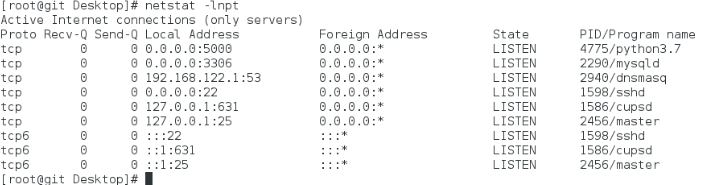
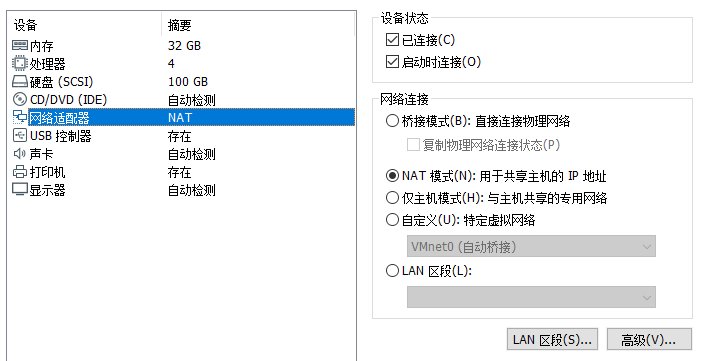
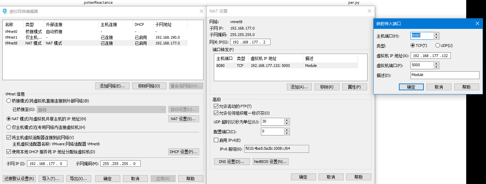
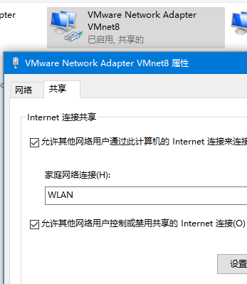

# Vmware虚拟机中创建网络/本地服务

```bash
# centOS中安装防火墙
yum install firewalld
# 查看已监听的端口
netstat -lnpt
# 形如0.0.0.0:5000即为正常
```



````bash
# 查看添加开放端口
firewall-cmd --zone=public --list-ports 
````


````bash
firewall-cmd --add-port=5000/tcp --permanent
firewall-cmd --reload
# ifconfig查询IP
# eno16777736: flags=4163<UP,BROADCAST,RUNNING,MULTICAST>  mtu 1500
#       inet 192.168.177.132  netmask 255.255.255.0  broadcast 192.168.177.255
````

````bash
# 此时在宿主机上，可以通过Navicat，访问192.168.177.132：5000端口下的服务
# 需要从其他客户机访问位于宿主机的虚拟机中的服务时，需在vmware中设置端口转发
# ifconfig查询IP
# eno16777736: flags=4163<UP,BROADCAST,RUNNING,MULTICAST>  mtu 1500
#       inet 192.168.177.132  netmask 255.255.255.0  broadcast 192.168.177.255
# 如下设置NAT模式
# 即可通过宿主机IP:8080端口对虚拟机服务进行访问
# 应同时设置VMware VMNET8属性，同意通过Wlan进行连接（如果宿主机挂载wlan上）
````





