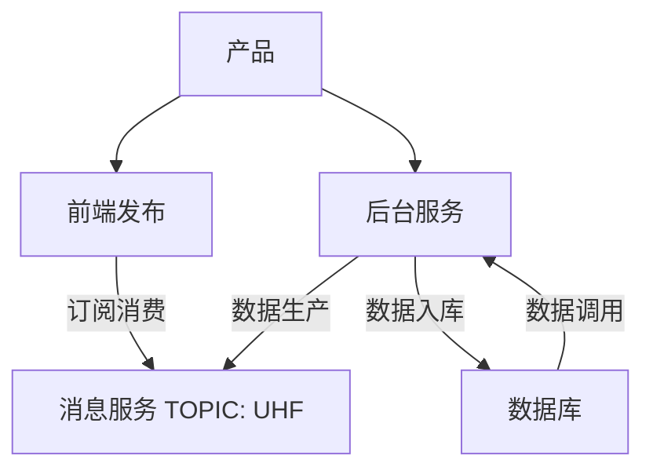
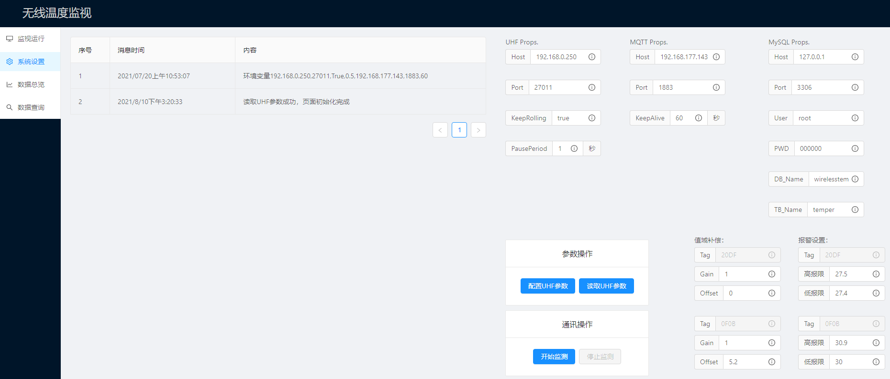
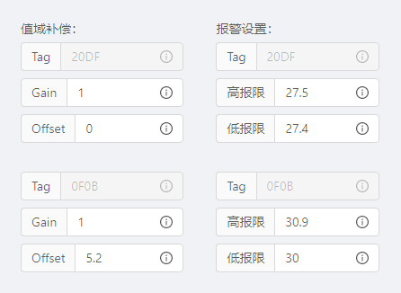
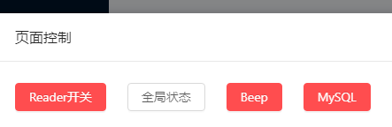

## UHF产品说明书及部署手册（Beta）

[toc]

## 1.概述
该软件的主要功能是对UHFReader288进行基于TCP/IP通讯的读写器控制，兼具数据入库、Web前端发布、数据查询功能。软件主要由后台（UHF_service_background）与前端（UHF_service_front）构成，除此以外，还需要MQTT与MySQL做消息转发与数据存储支持。


::::tip
MQTT使用以下命令部署，或自行部署
```sh
docker pull emqx/emqx:v4.0.0
docker run -it --name emqx -p 1883:1883 -p 8083:8083 -p 8883:8883 -p 8084:8084 -p 18083:18083 emqx/emqx:v4.0.0
user:admin psw:public1
```
::::


::::danger
MySQL >= v8.0
::::

***

## 2.软件架构


本软件的前端发布服务（UHF_service_front）、后台服务（UHF_service_background）、消息队列（MQTT）均使用Docker做容器化部署。其中MQTT服务由第三方提供；MySQL由生产环境提供。

UHF_service_front容器内，前端的发布使用NGINX挂载，基于VUE2开发；UHF_service_background容器内，服务使用GUNICORN挂载，基于Python371开发；MQTT使用EMQXv4.0.0[^1]发布，；MySQL为8.0.18。

产品安装包中，提供名为【uhf_front部署文件】和【uhf_back部署文件】的文件夹，其内容物为UHF_service_front、UHF_service_background的镜像导出文件及其使用说明。

***

## 3.环境
CentOS7、Docker 19.03.13、MySQL 8.0.18

***

## 4.部署
默认已完成环境（Python）部署。

### 4.1.MySQL初始化
MySQL缺省设置端口3306、用户root，密码000000，并创建以wirelesstemper为名的Database和其下以temper为名的scheme。根据传感器ID设计数据表，如对于20DF与0F0B两个温度标签，表形式为：

```sh
------------------------------------------
|	timestamp	|	20DF	|	0F0B	|
------------------------------------------
```

:::warning
timestamp：类型timestamp，长度0，小数点0，非null
20DF：类型double，长度255，小数点8
0F0B：类型double，长度255，小数点8
:::

开启远程连接，为'root'@'%'与000000开启mysql_native_password权限：
```sh
# 登陆Mysql
USE mysql;
SELECT user,port from user;
+-----------+------+
| host      | user |
+-----------+------+
| 127.0.0.1 | root |
+-----------+------+
CREATE USER 'root'@'%' IDENTIFIED BY 'your password'; 
GRANT ALL ON *.* TO 'root'@'%'; 
ALTER USER 'root'@'%' IDENTIFIED WITH mysql_native_password BY 'your password';
FLUSH PRIVILEGES;

# 检查修改情况应为
+-----------+------+
| host      | user |
+-----------+------+
| %         | root |
+-----------+------+
```

### 4.2	容器部署
系统设置本地IP地址为192.168.177.143。

### 4.2.1	UHF_service_background部署
```bash
# 拷贝镜像文件至本地，执行bash命令
[root@vm00 uhf_back部署文件]# docker load<uhf_service_background
[root@vm00 uhf_back部署文件]# docker run --it -e TZ="Asia/Shanghai" --name uhf_back -p 8123:8123 uhf_service_background:latest
```

### 4.2.2	UHF_service_front部署
```bash
# 拷贝镜像文件至本地，执行bash命令
[root@vm00 uhf_front部署文件]# docker load<uhf_service_front
[root@vm00 uhf_front部署文件]# docker run --it --name uhf_front -p 8124:8124 uhf_service_front:latest
```

### 4.2.3	MQTT部署[^2]
```bash
[root@vm00 $]# docker run -d --name emqx -p 1883:1883 -p 8083:8083 -p 8883:8883 -p 8084:8084 -p 18083:18083 emqx/emqx:v4.0.0
```

### 4.2.4	防火墙设置
```bash
# 环境中应安装firewalld服务
# 检查TCP端口
[root@vm00 $]# firewall-cmd --zone=public --list-port
# 输出应当至少包括：8123/tcp 8124/tcp 18083/tcp，如无，应添加永久端口
[root@vm00 $]# firewall-cmd --add-port=8123/tcp --permanent
[root@vm00 $]# systemctl restart firewalld
# 如使用虚拟机，还应注意在NAT模式中转发内部虚拟机的上述端口
```

***

## 5.操作重点与说明
首次运行时，应先至【系统设置】页面配置相关参数，如图：



其中，UHF Props中，Host、Port一般不变，为读写器网络地址与端口；keepRolling为true，表示持续读数；PausePeriod表示采样间隔，不仅控制后台相关服务对TCP端口的读取频率，也控制入库数据频率，一般为0.001~0.2。

MQTT Props中，Host、Port表示EMQX服务所在的网络地址和端口，为192.168.177.143、127.0.0.1（本地）或其它及1883，keepAlive为后台与MQTT服务链接无响应存活时间，一般为60。

MySQL Props中，Host、Port表示MySQL服务所在的网络地址和端口，为192.168.177.143、127.0.0.1（本地）或其它及3306，User、PWD为MySQL访问用户名与密码，DB_Name、TB_Name为本产品相关数据库参数，必须与前述设置相对应（大小写敏感）。



值域补偿是对传感器数据进行的线性修正；报警逻辑为含该值在内的触发报警。

:::danger
注意：修改完上述参数后，需使用【配置UHF参数】按钮上传参数至后台，或使用【读取UHF参数】进行最近一次参数配置方案的调用。
:::

【开启监测】前，应在页面下方的【Click】中打开后台的TCP阅读服务；若需开启数据存储，还应触发【MySQL】，如下图：



:::danger
注意：【Reader开关】触发后至后台服务停止前可不再重复触发。Release版中删除此功能。
:::

产品中包括温度标签内报警次数、最高最低温度与数据总览中“近期数据描述”在内的统计性数值，均指近期测量数据[^3]的统计值；且该类统计值在后台服务重启前，不会重置。

数据查询页面中，标准值的计算如下式：

$$
\frac{Value_{measured} - \{Values\}_{min} }{\{Value\}_{max} - \{Value\}_{min}} = Value_{std}
$$

[^1]:镜像ID为c8ca10ec25b0
[^2]:EMQX管理主页为端口18083，ID：admin，PWD：public
[^3]:近期测量数据暂定为50个采样数据，release版修改
