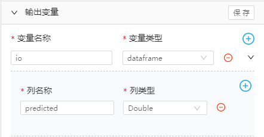

### 数据输入配置说明

- 计算窗口大小

  1秒表示每次进入计算的数据尺寸。在run_iteration算子中，已经通过iterations参数对需要进行迭代的变量进行了缓存。不可在此进行窗口设置。

- 计算滑动步长

  1秒表示计算后的静默次数为（1-1=0）

### 计算节点配置说明

- 输入变量中，包括变量名称【io】、变量类型【dataframe】、列名称【measuredData】、列类型【Double】在内的设置不可自定义
- 输出变量中，包括变量名称【io】、变量类型【dataframe】、列名称【predicted】、列类型【Double】在内的设置不可自定义
- 固定参数中，包括变量名称【windowSize】、数据类型【Integer】在内的设置不可自定义
- 固定参数中，包括变量名称【smoothSize】、数据类型【Double】在内的设置不可自定义
- 迭代参数中，包括变量名称【X S1 S2 S3 lineRecord】、数据类型【String】、值【None】在内的设置不可自定义

|                                                           |                                                           ||
| :-------------------------------------------------------: | :-------------------------------------------------------: | :-------------------------------------------------------: |
|  |  ||
||||

