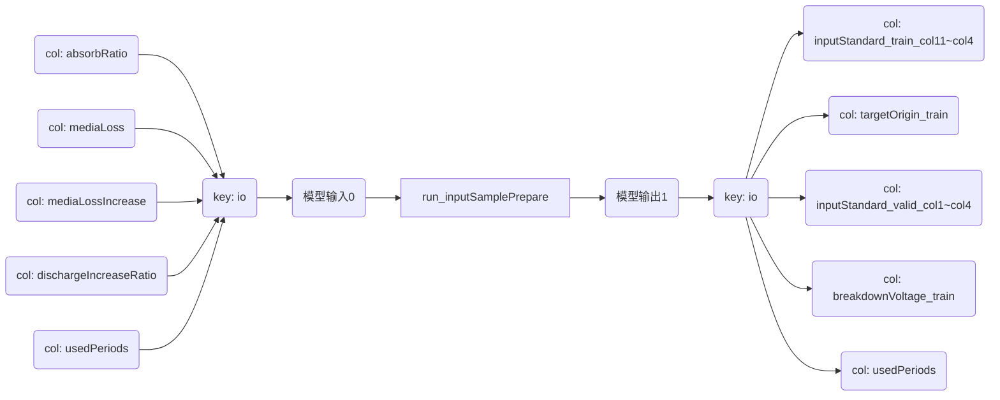
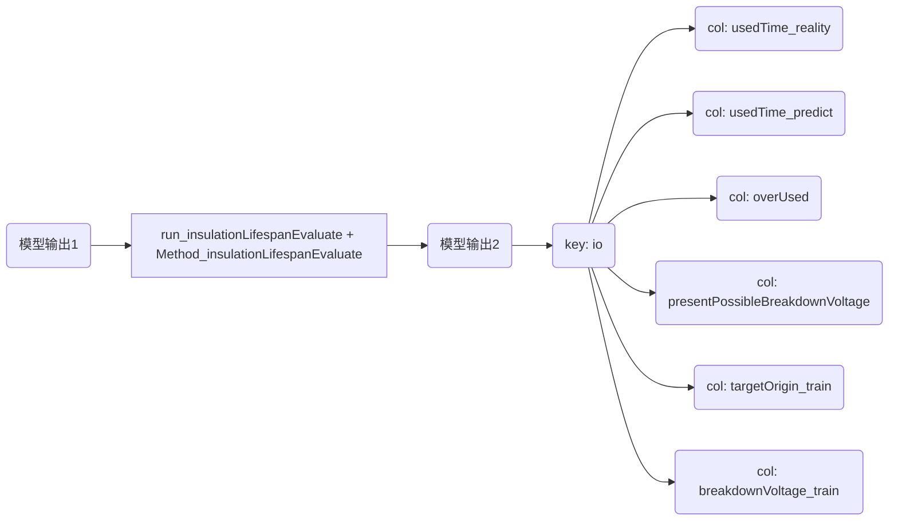
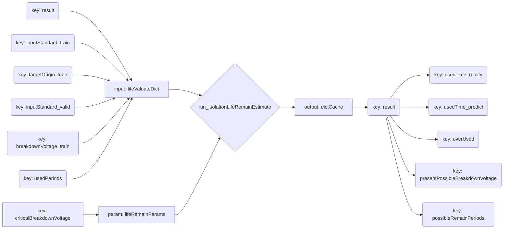

# 发电机定子线棒绝缘状态评估模型V1.0

## 1. 模块文件名称

a. <kbd>Method_insulationLifespanEvaluate_V1.0_Beta.so</kbd>

b. <kbd>run_inputSamplePrepare_V1.0_Beta.so</kbd>

c. <kbd>run_insulationLifeRemainEstimate_V1.0_Beta.so</kbd>

d. <kbd>run_insulationLifeRemainEstimate_V1.0_Beta.so</kbd>

## 2. 模块功能说明

根据代码(<kbd>run_inputSamplePrepare</kbd>)中内置的、通过实验所积累的样本数据，对新输入的实验数据所代表的线棒绝缘状态进行评估，包括：线棒已使用周期理论计算值；线棒当前击穿电压预测值；线棒残余寿命预测值；线棒是否长期处于非优工况运行。

## 3. 模块结构

该模块由如下文件构成：

a.方法文件：<kbd>Method_insulationLifespanEvaluate</kbd>

b.算子文件：<kbd>run_inputSamplePrepare</kbd>、<kbd>run_insulationLifeRemainEstimate</kbd>、<kbd>run_insulationLifeRemainEstimate</kbd>

c.模型使用说明：本文。

## 4. 模型输入输出

| 序号 | 模型/方法/函数                                               | 输入变量名 | 输入列名                                                     | 输入列基本类型                                               | 输出变量名 | 输出列名                                                     | 输出列基本类型                                               | 参数                                                         | 备注 |
| :--- | :----------------------------------------------------------- | :--------- | :----------------------------------------------------------- | :----------------------------------------------------------- | :--------- | :----------------------------------------------------------- | :----------------------------------------------------------- | :----------------------------------------------------------- | :--- |
| 1    | run_inputSamplePrepare                                       | io         | absorbRatio吸收比<br>mediaLoss介损<br>mediaLossIncrease介损增量<br>dischargeIncreaseRatio放电量增加率<br>usedPeriods已运行时间 | float<br>float<br>float<br>float<br>float<br>                | io         | inputStandard_train_col1<br/>inputStandard_train_col2<br/>inputStandard_train_col3<br/>inputStandard_train_col4<br/>targetOrigin_train<br/>inputStandard_valid_col1<br/>inputStandard_valid_col2<br/>inputStandard_valid_col3<br/>inputStandard_valid_col4<br/>usedPeriods<br/>breakdownVoltage | float<br/>float<br/>float<br/>float<br/>float<br/>float<br/>float<br/>float<br/>float<br/>float<br/>float | 无                                                           | 无   |
| 2    | run_insulationLifespan<br>Evaluate<br>同时调用：Method_insulationLifespanEvaluate | io         | inputStandard_train_col1<br>inputStandard_train_col2<br>inputStandard_train_col3<br>inputStandard_train_col4<br>targetOrigin_train<br>inputStandard_valid_col1<br>inputStandard_valid_col2<br>inputStandard_valid_col3<br>inputStandard_valid_col4<br>usedPeriods<br>breakdownVoltage | float<br>float<br>float<br>float<br>float<br>float<br>float<br>float<br>float<br>float<br>float | io         | usedTime_reality<br>usedTime_predict<br>overUsed<br>presentPossibleBreakdownVoltage<br>targetOrigin_train<br>breakdownVoltage_train | float<br>float<br>string<br>float<br>float<br>float<br>      | lifespanInherentError=5 float 已使用周期的实际与预测值的固有误差 | 无   |
| 3    | run_insulationLifeRem<br>ainEstimate                         | io         | usedTime_reality<br>usedTime_predict<br>overUsed<br>presentPossibleBreakdownVoltage<br>targetOrigin_train<br>breakdownVoltage_train<br> | float<br>float<br>string<br>float<br>float<br>float<br>      | io         | usedTime_reality<br>usedTime_predict<br>overUsed<br>presentPossibleBreakdownVoltage<br>possibleRemainPeriods<br> | float<br>float<br>string<br>float<br>float<br>               | criticalBreakdownVoltage=13.421 float 击穿电压临界值         | 无   |

## 5. 模型调用流程







## 6. 模型调用示例

### 6.1 代码示例

<kbd style="color: red">真实代码</kbd>

```python
import pandas as pd
from pandas import DataFrame as DF

import run_inputSamplePrepare
import run_insulationLifespanEvaluate
import run_insulationLifeRemainEstimate


# 前端输入以下变量
cache = {"absorbRatio": csv_file.loc[i, "absorbRatio"],
                 "mediaLoss": csv_file.loc[i, "mediaLoss"],
                 "mediaLossIncrease": csv_file.loc[i, "mediaLossIncrease"],
                 "dischargeIncreaseRatio": csv_file.loc[i, "dischargeIncreaseRatio"],
                 "usedPeriods": csv_file.loc[i, "period"],}
measuredData = {"io": DF([cache])}
preparedSampleDict = run_inputSamplePrepare.run(measuredData, None, None)
lifespanParams = {"lifespanInherentError": 5}
lifeValuateDict = run_insulationLifespanEvaluate.run(preparedSampleDict, lifespanParams, None)
lifeRemainParams = {"criticalBreakdownVoltage": 13.421}
dictCache = run_insulationLifeRemainEstimate.run(lifeValuateDict, lifeRemainParams, None)
print(i, dictCache["io"])
```

### 6.2 示例代码输出

|      | usedTime_reality<br>现实已使用时间 | usedTime_predict<br>预测已使用时间 | overUsed<br>是否过度运行 | presentPossibleBreakdownVoltage<br>当前击穿电压预测值 | possibleRemainPeriods<br>可能的残余寿命 |
| :--- | :--------------------------------: | :--------------------------------: | :----------------------: | :---------------------------------------------------: | :-------------------------------------: |
| 0    |                225                 |                224                 |          False           |                       17.503078                       |                   76                    |

### 7. 必要说明
* 1. 当实测样本突破训练用样本任一变量的运行范围（吸收比<0.534037，介损>2.117359，介损增量>0.801708，放电量增加率>0.781554，已运行时间>299）时，模型无法正常运行；
* 2. 为实现样本保密，扩大样本需修改源代码；
* 3. 前端部署时，应注意标注“可能的残余寿命”的相对起始时间点（即，最近一次输入实测样本并调用该模块的时间）。

### 8. 主要环境依赖

 

 

 


